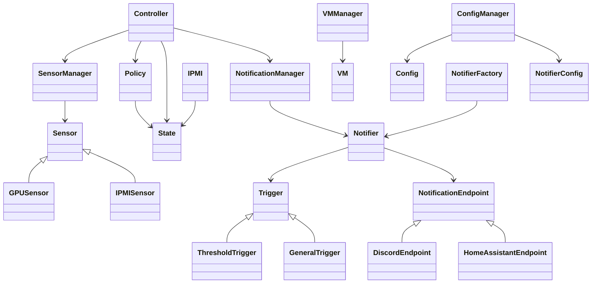

```mermaid
classDiagram

Controller --> SensorManager
Controller --> Policy
Controller --> State
Controller --> NotificationManager

SensorManager --> Sensor

Sensor <|-- GPUSensor
Sensor <|-- IPMISensor

Policy --> State
IPMI --> State

VMManager --> VM
ConfigManager --> Config
ConfigManager --> NotifierConfig

NotificationManager --> Notifier
NotifierFactory --> Notifier

Notifier --> Trigger
Notifier --> NotificationEndpoint

Trigger <|-- ThresholdTrigger
Trigger <|-- GeneralTrigger

NotificationEndpoint <|-- DiscordEndpoint
NotificationEndpoint <|-- HomeAssistantEndpoint
```