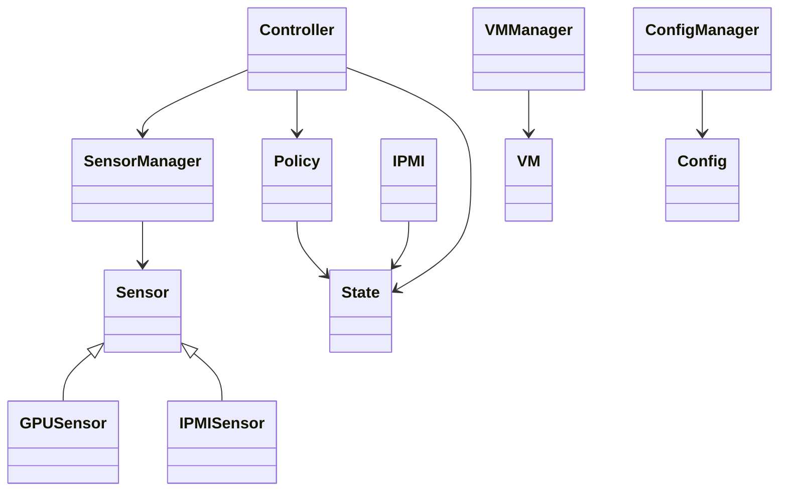

```mermaid
classDiagram

Controller --> SensorManager
Controller --> Policy
Controller --> State

SensorManager --> Sensor

Sensor <|-- GPUSensor
Sensor <|-- IPMISensor

Policy --> State
IPMI --> State

VMManager --> VM
ConfigManager --> Config
```