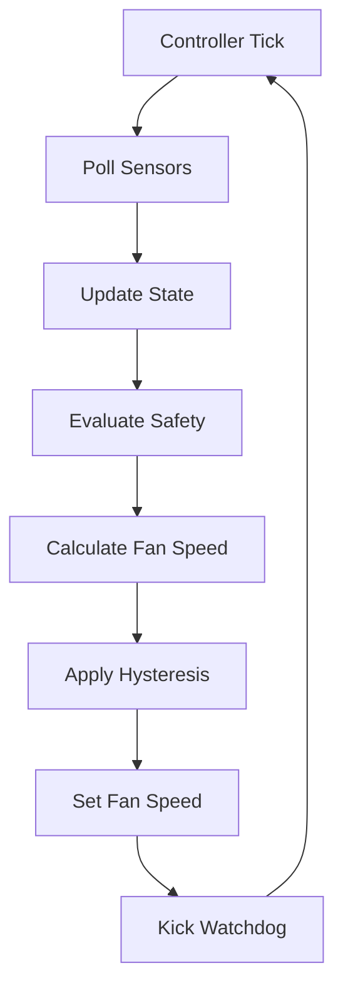

```mermaid
flowchart TD

A[Controller Tick]

A --> B[Poll Sensors]

B --> C[Update State]

C --> D[Evaluate Safety]

D --> E[Calculate Fan Speed]

E --> F[Apply Hysteresis]

F --> G[Set Fan Speed]

G --> H[Kick Watchdog]

H --> A
```