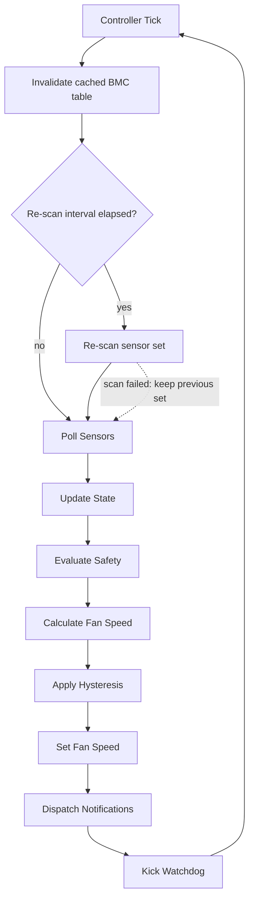

```mermaid
flowchart TD

A[Controller Tick]

A --> A1[Invalidate cached BMC table]

A1 --> A2{Re-scan interval elapsed?}

A2 -- yes --> A3[Re-scan sensor set]

A2 -- no --> B

A3 --> B

A3 -.->|scan failed: keep previous set| B

B[Poll Sensors]

B --> C[Update State]

C --> D[Evaluate Safety]

D --> E[Calculate Fan Speed]

E --> F[Apply Hysteresis]

F --> G[Set Fan Speed]

G --> H[Dispatch Notifications]

H --> I[Kick Watchdog]

I --> A
```