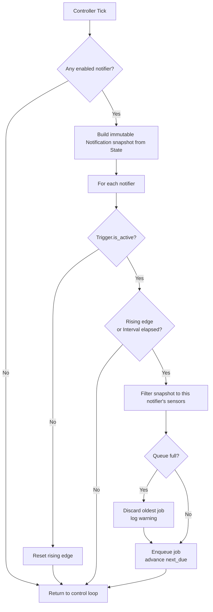
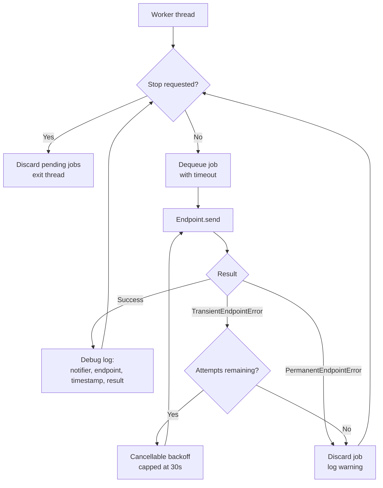

# Notification Flow

One notification's life, from control loop to endpoint.

The two diagrams below run on **different threads**. Everything in the first runs on the
controller thread and performs no I/O; everything in the second runs on the notifier's own worker
thread. The bounded queue is the only thing that crosses between them, and the only thing handed
across is an immutable snapshot.

## Scheduling — controller thread

A rising edge — the trigger becoming active after being inactive — always fires immediately.
`next_due` is advanced only here, so delivery outcome and retries never shift a notifier's
schedule.

## Delivery — worker thread

Transient failures — connection, DNS, TLS, timeout, `5xx`, and `429` — are retried within the
notifier's `MaxAttempts`. Permanent failures, including authentication and authorisation
failures, discard the job on the first attempt rather than burning the retry budget on a request
that will never succeed.

Endpoint failure never deactivates a notifier. After a job is discarded, the worker continues
with the next one.

## Invariants

- The controller thread never performs network I/O.
- Nothing mutable crosses the queue; only a detached, immutable snapshot does.
- Queue capacity, queue overflow, and delivery failure are per notifier. One endpoint's
  saturation or outage cannot consume another's capacity or block its worker.
- Both paths terminate. The queue is bounded, retries are bounded, and backoff is capped.
