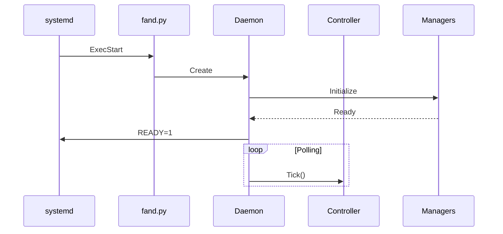

```mermaid
sequenceDiagram

participant systemd
participant fand.py
participant Daemon
participant Controller
participant Managers

systemd->>fand.py: ExecStart

fand.py->>Daemon: Create

Daemon->>Managers: Initialize

Managers-->>Daemon: Ready

Daemon->>systemd: READY=1

loop Polling

Daemon->>Controller: Tick()

end
```