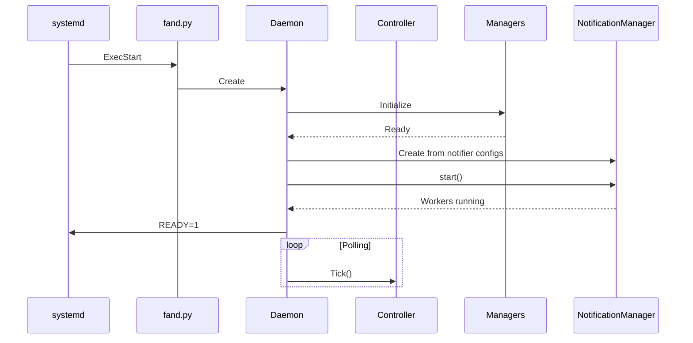

```mermaid
sequenceDiagram

participant systemd
participant fand.py
participant Daemon
participant Controller
participant Managers
participant NotificationManager

systemd->>fand.py: ExecStart

fand.py->>Daemon: Create

Daemon->>Managers: Initialize

Managers-->>Daemon: Ready

Daemon->>NotificationManager: Create from notifier configs

Daemon->>NotificationManager: start()

NotificationManager-->>Daemon: Workers running

Daemon->>systemd: READY=1

loop Polling

Daemon->>Controller: Tick()

end
```